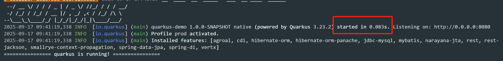

# Quarkus Serverless Starter

This is a minimal CRUD service example project built with [Quarkus](https://quarkus.io/), demonstrating how to build high-performance REST API services using the Quarkus framework and integrate with Hibernate ORM.

## What is Quarkus?

Quarkus is a Kubernetes Native Java framework tailored for OpenJDK HotSpot and GraalVM, built on top of the best-of-breed Java libraries and standards. Dubbed "Supersonic Subatomic Java," it is specifically optimized for container-first and cloud-native scenarios.

### Quarkus vs Spring Boot

Compared to traditional Spring Boot framework, Quarkus has significant advantages in multiple aspects:

1. **Startup Speed**: Quarkus applications start 10-80 times faster than Spring Boot
    - Spring Boot applications typically take several seconds to over ten seconds to start
    - Quarkus JVM mode startup time is between 100-500ms
    - Quarkus Native mode startup time is only 10-50ms

2. **Memory Footprint**: Quarkus uses 70-90% less memory than Spring Boot
    - Spring Boot applications typically require 200-500MB of memory
    - Quarkus JVM mode requires only 50-100MB
    - Quarkus Native mode requires only 25-50MB

3. **Artifact Size**: Quarkus generates artifacts that are 3-10 times smaller than Spring Boot
    - Spring Boot applications typically have JAR files of 50-100MB
    - Quarkus JVM mode JAR files are typically just a few MB
    - Quarkus Native mode executable files are approximately 20-50MB

These advantages make Quarkus an ideal choice for containerized deployments, microservice architectures, and Serverless scenarios.

### What is Quarkus Native?

Quarkus Native is a core feature of the Quarkus framework that uses GraalVM's native-image technology to compile Java applications into native executables. This native compilation process is completed at build time rather than runtime, eliminating much of the runtime overhead of traditional Java applications.

#### Java Native Concept

Java Native refers to the technology that uses tools like GraalVM to ahead-of-time (AOT) compile Java bytecode into machine code. Unlike traditional Just-In-Time (JIT) compilation, native compilation completes most optimization work before the application runs, including:

- Class loading analysis and optimization
- Pre-resolution of reflection calls
- Dead code elimination
- Memory layout optimization

#### Native Mode Performance Comparison

| Metric | Spring Boot | Quarkus JVM | Quarkus Native |
|--------|-------------|-------------|----------------|
| Startup Time | 3000-5000ms | 200-500ms | 10-50ms |
| Memory Usage | 300-500MB | 80-150MB | 25-50MB |
| Response Time | Baseline | Baseline | Baseline |
| Image Size | 50-100MB | 5-20MB | 20-50MB |

## Project Overview

This project demonstrates the following features:
- Building RESTful APIs with Quarkus
- Integrating Hibernate ORM with Panache for data persistence
- Implementing basic CRUD operations
- Demonstrating Quarkus's native executable building capability

Through this project, you can experience Quarkus framework's rapid development mode and excellent performance, especially the ultimate startup speed and memory efficiency brought by Quarkus Native. Whether you want to learn modern cloud-native Java development or improve application performance and resource utilization, this project is an excellent starting point.

The figure below shows the startup speed through the Quarkus native executable, with the measured speed as follows: 83 ms


## Quick Start

## Database Configuration

The project uses MySQL database by default, configured in the `src/main/resources/application.properties` file:

```properties
quarkus.datasource.db-kind=mysql
quarkus.datasource.username=
quarkus.datasource.password=
quarkus.datasource.jdbc.url=jdbc:mysql://192.168.0.1:3306/yudao?useSSL=false&serverTimezone=Asia/Shanghai&allowPublicKeyRetrieval=true&nullCatalogMeansCurrent=true&rewriteBatchedStatements=true
```

Database connection configuration can be modified according to the actual environment.

### Running the Application

Run the application in development mode:

```bash
./mvnw quarkus:dev
```

The application will start on `http://localhost:8080`.

### Testing the API

The application provides the following REST API endpoints:

- `GET /hello` - Returns "hello"
- `GET /hello/greeting/{name}` - Returns a greeting
- `GET /hello/users` - Get all users
- `GET /hello/users/{id}` - Get user by ID
- `POST /hello/users` - Create a new user
- `PUT /hello/users/{id}` - Update a user
- `DELETE /hello/users/{id}` - Delete a user

## Local Startup

```
 Start the application through ProjectMain.main() in the IDE
```

## Building Native Executables

First, navigate to the project directory:

```bash
cd quarkus-demo
```

Quarkus supports building native executables, which can achieve faster startup speed and lower resource consumption.

### Direct Build with Maven

You can build native executables with the following command:

```bash
./mvnw install -Pnative
```

> ⚠️ **Note**: Directly building with Maven requires local installation and configuration of GraalVM and related dependencies. If the local environment lacks the relevant dependencies or the configuration is incorrect, the build may fail. Particularly on different operating systems, specific build tools and libraries may need to be installed.
>
> 🪟 **Windows System Notes**: Building directly with Maven on Windows will generate Windows platform executable files (.exe), but requires GraalVM for Windows and Visual Studio Build Tools or Visual Studio 2022 to be installed.

### Building with Docker Image (Recommended)

To ensure build environment consistency, it is recommended to use the Docker image provided by Quarkus official for building. You can use the following command to specify the build image:

```bash
./mvnw install -Pnative -Dquarkus.native.builder-image=quay.io/quarkus/ubi-quarkus-native-image:22.3-java17
```

> ℹ️ **Note**: Docker image building refers to starting a dedicated container environment for building Quarkus Native applications locally through Docker, where the compilation process from Java code to native executable is completed. After the build is completed, the generated executable will be output to the local `target` directory, rather than running the service in the Docker container. This approach avoids the complexity of local environment configuration and ensures the consistency and reproducibility of the build process.
>
> 🐧 **Platform Limitation**: Building with Docker image can only generate Linux platform executables, regardless of whether the command is executed on Windows or macOS. If you need to build Windows executables, you must build directly with Maven in a Windows environment.

This approach will complete the native executable build inside Docker and directly package it into a minimized image.

### Running the Built Executable

After the build is completed, you can find the generated executable file in the `target` directory. Depending on the build method and platform, the name and format of the executable file will also be different:

- **Direct Maven Build (Windows)**: [target\getting-started-1.0.0-SNAPSHOT-runner.exe](file://D:\project\IdeaProjects\personal\quarkus-demo\target\getting-started-1.0.0-SNAPSHOT-runner.exe)
- **Docker Image Build (All Platforms)**: [target/getting-started-1.0.0-SNAPSHOT-runner](file://D:\project\IdeaProjects\personal\quarkus-demo\target/getting-started-1.0.0-SNAPSHOT-runner)

The executable can be run directly without installing a JVM, with faster startup speed and lower memory consumption:

```bash
# Linux/macOS (Docker Image Build Result)
./target/getting-started-1.0.0-SNAPSHOT-runner

# Windows (Direct Maven Build Result)
target\getting-started-1.0.0-SNAPSHOT-runner.exe
```

## Project Structure

```
src/
├── main/
│   ├── java/
│   │   └── org/acme/getting/started/
│   │       ├── User.java              # User entity class
│   │       ├── UserRepository.java     # User data access class
│   │       ├── UserService.java        # User service class
│   │       ├── GreetingService.java    # Greeting service class
│   │       ├── GreetingController.java   # REST resource class
│   │       └── DbRowSample.java       # Database operation example
│   └── resources/
│       ├── application.properties      # Application configuration file
│       └── create-table.sql           # Table creation statement
└── test/
    └── java/
        └── org/acme/getting/started/
            └──  GreetingResourceTest.java  # Unit tests
```

## Quarkus and Cloud Native Applications

The above is the Quarkus getting started example and deployment build process. Through experiencing the Quarkus native executable startup, have you felt the lightning-fast startup speed? This excellent performance makes Quarkus an ideal choice for cloud-native application development.

### Quarkus Cloud Native Advantages

Quarkus is designed specifically for cloud-native environments and has the following significant advantages:

1. **Ultra-fast Startup Speed**: Native mode startup time is only 10-50 milliseconds, 10-80 times faster than traditional Java frameworks
2. **Extremely Low Memory Consumption**: Runtime memory is only 10-50MB, saving 70-90% memory compared to traditional applications
3. **Small Artifact Size**: Generated executable files are 3-10 times smaller, reducing network transmission and storage overhead
4. **Container Optimization**: Deeply optimized for Docker and Kubernetes environments with higher resource utilization

### Serverless Architecture Introduction

Serverless is a cloud computing execution model where the cloud provider dynamically manages the allocation and provisioning of machine resources. Its core features include:

1. **Event-Driven**: Applications are triggered by events without continuous operation
2. **Auto Scaling**: Resources automatically adjust according to request volume without manual intervention
3. **Pay-Per-Use**: Only pay for the actual code execution, no charges when not executing
4. **No Ops**: No need to manage servers, operating systems or runtime environments

#### Pay-Per-Use Billing Details

One of the most attractive features of Serverless is its refined pay-per-use billing model. This billing method has the following characteristics:

- **Request-Level Billing**: Billing based on actual processed requests, not pre-allocated resources
- **Execution Time Billing**: Only bill for the actual running time of functions, accurate to milliseconds
- **Zero Requests Zero Cost**: Even if the service is deployed online, no fees are generated when there are no requests
- **Resource Elasticity**: No need to pre-provision resources for peak loads, avoiding resource idling waste

This billing model **can greatly save enterprise costs and server resources**, especially reflected in:

1. **Cost Optimization**: Enterprises only pay for the actual computing resources used, which can save up to 80% of costs compared to traditional server pre-payment models
2. **Resource Utilization Improvement**: Avoids the problem of server resource idling in traditional deployment models, with resource utilization approaching 100%
3. **O&M Cost Reduction**: No need for professional O&M teams to maintain servers, reducing labor costs
4. **Elastic Scaling Without Cost Risk**: The automatic scaling mechanism eliminates the resource pre-provisioning risk brought by traffic surges

This billing model is particularly suitable for the following scenarios:

1. **Burst Traffic Applications**: Temporary high-concurrency scenarios such as activity promotion, flash sales, etc.
2. **Low-Frequency Business Processing**: Periodic or occasional tasks such as scheduled tasks, data processing, report generation, etc.
3. **Event-Driven Processing**: File upload processing, message queue processing, IoT device data processing, etc.
4. **Microservice Splitting**: Split large applications into multiple small functions for independent deployment and billing
5. **Development and Testing Environments**: Avoid paying fixed fees for infrequently used testing environments

#### Mainstream Cloud Providers' Serverless Services

Major cloud service providers now support Serverless functionality, with their product names as follows:

- **Alibaba Cloud**: [Function Compute](https://www.alibabacloud.com/product/function-compute)
- **Amazon AWS**: [AWS Lambda](https://aws.amazon.com/lambda/)
- **Huawei Cloud**: [FunctionGraph](https://www.huaweicloud.com/product/functiongraph.html)
- **Tencent Cloud**: [Serverless Cloud Function (SCF)](https://cloud.tencent.com/product/scf)

These platforms provide complete Serverless solutions, support multiple programming languages, and have core features such as automatic scaling and pay-per-use billing.

### Serverless Challenges and Limitations

Although Serverless has many advantages, there are also some challenges and limitations:

1. **Cold Start Problem**: Traditional framework (such as Spring Boot) applications have slow startup speeds, which may cause users to experience noticeable waiting times in Serverless environments, affecting user experience
2. **Debugging Complexity**: Distributed architecture makes troubleshooting and debugging more difficult
3. **Vendor Lock-in**: Differences between Serverless platforms of different cloud providers result in high migration costs
4. **State Management Limitations**: The stateless nature of functions makes development of stateful applications complex

Especially the **cold start problem**, which is particularly evident for applications built with traditional Java frameworks (such as Spring Boot). Spring Boot applications typically take several seconds or even tens of seconds to start, which seriously affects user experience in Serverless environments, especially when functions need to frequently cold start.

### Perfect Combination of Quarkus and Serverless

Quarkus's features highly契合 with Serverless architecture requirements, and the combination has the following advantages:

1. **Ultimate Cold Start Performance**: Quarkus's fast startup capability significantly reduces Serverless function cold start time
2. **Efficient Resource Utilization**: Low memory consumption and small artifact size allow a single container to host more function instances
3. **Significant Cost Reduction**:
    - Reduce server resource requirements and save hardware costs
    - Faster response speed reduces computing time and billing duration
    - Smaller image size reduces storage and network transmission costs
4. **Elastic Scaling Optimization**: Fast startup capability enables applications to respond faster to traffic peaks and improve user experience

Serverless applications built with Quarkus can greatly save resources and server costs, especially suitable for modern cloud-native application scenarios that require fast response and elastic scaling. Quarkus, with its millisecond-level startup speed, perfectly compensates for the performance shortcomings of traditional frameworks in Serverless environments, achieving the dual advantages of **greatly saving enterprise costs without sacrificing user experience**.

## Serverless Online Experience

You can experience the project service deployed on the Serverless platform through the following address:

**Experience Address**: [quarkus-demo.hongdux.com](http://quarkus-demo.hongdux.com)

### API Interface Test Examples

This project provides rich REST API interfaces, which you can test through the following examples:

1. **Get Greeting**
   ```bash
   curl http://quarkus-demo.hongdux.com/hello
   ```

2. **Get Personalized Greeting by Name**
   ```bash
   curl http://quarkus-demo.hongdux.com/hello/greeting/Quarkus
   ```

3. **Get All Users**
   ```bash
   curl http://quarkus-demo.hongdux.com/hello/users
   ```

4. **Get User by ID**
   ```bash
   curl http://quarkus-demo.hongdux.com/hello/users/1
   ```

5. **Create New User**
   ```bash
   curl -X POST http://quarkus-demo.hongdux.com/hello/users \
        -H "Content-Type: application/json" \
        -d '{"username": "testuser", "email": "test@example.com", "fullName": "Test User", "age": 25}'
   ```

6. **Update User Information**
   ```bash
   curl -X PUT http://quarkus-demo.hongdux.com/hello/users/1 \
        -H "Content-Type: application/json" \
        -d '{"username": "updateduser", "email": "updated@example.com", "fullName": "Updated User", "age": 30}'
   ```

7. **Delete User**
   ```bash
   curl -X DELETE http://quarkus-demo.hongdux.com/hello/users/1
   ```

Through these API interfaces, you can fully experience the excellent performance of Quarkus in Serverless environments, feeling millisecond-level response speed and extremely low resource consumption.

## Professional Service Support

If you want to upgrade your existing services to the Quarkus framework or migrate to Serverless architecture, we provide a one-stop solution:

### Our Services Include:

- **Architecture Consulting**: Provide the most suitable technical architecture recommendations based on your business needs
- **Quarkus Migration**: Smoothly migrate traditional Java applications to the Quarkus framework to improve performance and resource utilization
- **Serverless Transformation**: Help you deploy applications to Serverless platforms to achieve ultimate elastic scaling and cost optimization
- **Performance Optimization**: Perform in-depth optimization of Quarkus applications to fully leverage their fast startup speed and low memory consumption advantages
- **Full-Cycle Support**: Full technical support from architecture design, development implementation to online O&M

### Why Choose Us?

✅ **Expert Technical Team**: Rich practical experience in Quarkus and Serverless  
✅ **Cost Optimization Solutions**: Help enterprises reduce 60%+ server costs  
✅ **Performance Improvement Guarantee**: Achieve 10-80 times startup speed improvement  
✅ **Seamless Migration Services**: Minimize business migration risks  
✅ **Continuous Technical Support**: Provide long-term technical support and consulting services

### Contact Us

Want to know how to reduce costs and improve efficiency for your enterprise through Quarkus and Serverless technologies?

📧 Email: [zhujunjie@hongdux.com](mailto:service@hongdux.com)  
🌐 Website: [www.hongdux.com](http://www.hongdux.com)  
📱 WeChat: hongdux

Let us help your application achieve dual optimization of performance and cost!